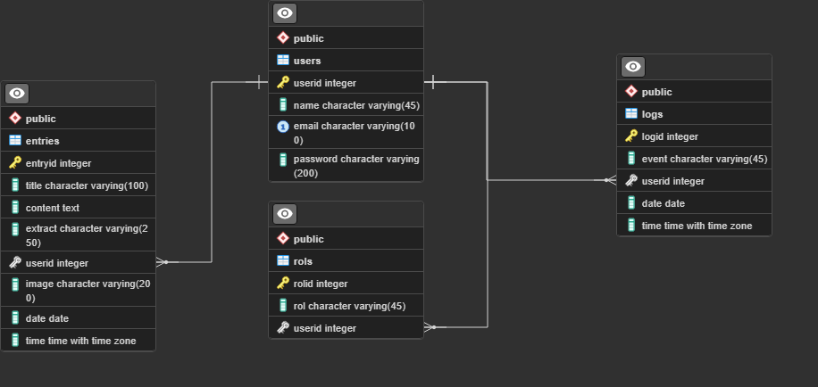

# Blog: Back

Aquí encontramos **2 APIs** para gestionar a los *usuarios* y las *entradas* del blog:
* Users
* Entries:

---
## Base de datos
El motor de base de datos utilizado es postgreSQL, que esta subido en **[elephantSQL](https://www.elephantsql.com/)**
\**(Datos de conexión al final)*

### Relaciones:

---
## API Users:

#### **getUsers:**
* Devuelve:
    * ok: **true** o **false**
    * data: **todos los usuarios**
* Ruta: **/api/users/**
* Método: **GET**
  
#### **getUserByEmail:**
* Devuelve: 
    * ok: **true** o **false**
    * data: **los datos de un usuario concreto buscándolo por su email**
* Requiere: **email**
* Ruta: **/api/users/:email**
* Método: **GET**

#### **createUser:** 
* Devuelve:
    * ok: **true** o **false**
    * data: **los datos del usuario creado**
* Requiere: **name, password e email**
* Ruta: **/api/users/**
* Método: **POST**

#### **changePassword:** cambia la contraseña de un usuario.
* Devuelve:
    * ok: **true** o **false**
    * msg: **información sobre el cambio**
* Requiere: **email, oldPassword y newPassword**
* Ruta: **/api/users/**
* Método: **PUT**

#### **login:** verifica y registra el login del usuario.
* Devuelve:
    * ok: **true** o **false**
    * msg: **información sobre el login**
    * user: **los datos el usuario que se ha logueado**
* Requiere: **email y password**
* Ruta: **/api/users/login**
* Método: **POST**

#### **logout:** registra el logout del usuario.
* Devuelve:
    * ok: **true** o **false**
    * msg: **información sobre el logout**
* Requiere: **email**
* Ruta: **/api/users/logout**
* Método: **POST**

---
## API Entries:
#### **getEntries:**
* Devuelve:
  * ok: **true** o **false**
  * totalEntries: **cantidad total de entradas**
  * limit: **cantidad de entradas por página**
  * totalPages: **cantidad total de páginas**
  * page: **página actual**
  * data: **todas las entradas**
* Ruta: **/api/entries/**
* Método: **GET**
* Querys opcionales: 
    * **limit**, cantidad de entradas por página (Por defecto: 10).
    * **page**, la página que quieres que devuelva (Por defecto: 1).  
  
#### **getEntriesBySearch:** 
* Devuelve:
  * ok: **true** o **false**
  * totalEntries: **cantidad total de entradas**
  * limit: **cantidad de entradas por página**
  * totalPages: **cantidad total de páginas**
  * page: **página actual**
  * data: **contiene todas las entradas que conicidan con el texto (título o contenido)**
* Requiere: **text**
* Ruta: **/api/entries/search/:text**
* Método: **GET**
* Querys opcionales: 
  * **limit**, cantidad de entradas por página (Por defecto: 10).
  * **page**, la página que quieres que devuelva (Por defecto: 1).

#### **getEntriesByEmail:** 
* Devuelve: 
    * ok: **true** o **false**
    * totalEntries: **cantidad total de entradas**
    * limit: **cantidad de entradas por página**
    * totalPages: **cantidad total de páginas**
    * page: **página actual**
    * data: **todas las entradas que conicidan con el email**
* Requiere: **email**
* Ruta: **/api/entries/email/:email**
* Método: **GET**
* Querys opcionales: 
    * **limit**, cantidad de entradas por página (Por defecto: 10).
    * **page**, la página que quieres que devuelva (Por defecto: 1).

#### **getEntryByID:** 
* Devuelve: 
    * ok: **true** o **false**
    * data: **la entrada que coincide con el ID**            
* Requiere: **id**
* Ruta: **/api/entries/id/:id**
* Método: **GET**

#### **createEntry:** 
* Devuelve: 
    * ok: **true** o **false**
    * data: **los datos de la entrada creada**
* Requiere: **title, extract, content, image e email**
* Ruta: **/api/entries/**
* Método: **POST**

#### **updateEntry:** 
* Devuelve: 
    * ok: **true** o **false**
    * data: **los datos de la entrada modificada**
* Requiere: **title, extract, content, image e entryID**
* Ruta: **/api/entries/**
* Método: **PUT**

#### **deleteEntry:** 
* Devuelve: 
    * ok: **true** o **false**
* Requiere: **entryID**
* Ruta: **/api/entries/:entryID**
* Método: **DELETE**

---
## .env:
#### Requiere:
* El puerto del servidor: **PORT**=3000
* La conexión a la BD:
    * **ELEPHANT_USER**=ucyoiydj
    * **ELEPHANT_PASS**=AP8gl95xBgSEjFNy0OAK1O3ssRJbk69n
    * **ELEPHANT_HOST**=rogue.db.elephantsql.com
    * **ELEPHANT_DB**=ucyoiydj
